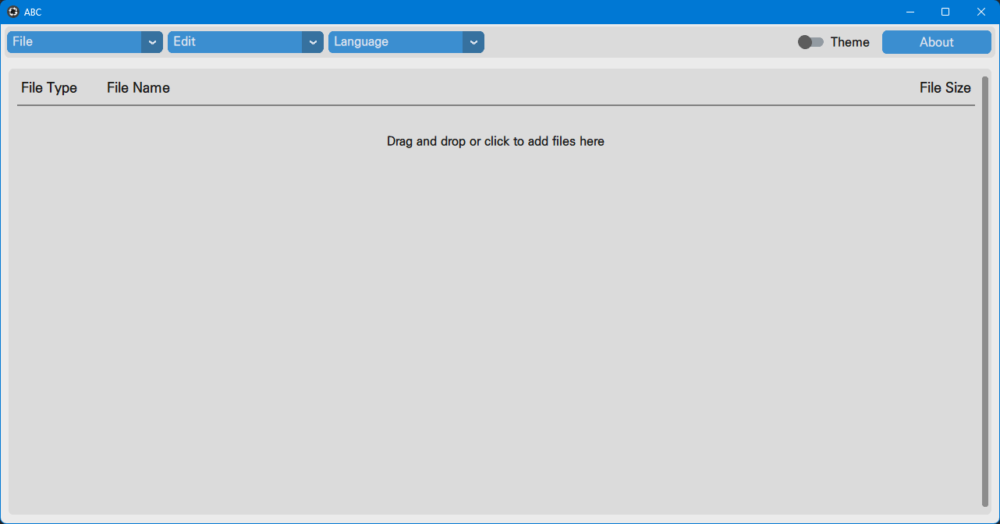

## ABC

### All Batch Converter

This program converts files such as images, audio, and more in various formats to the format you specify.



And this program is implemented in Python([CustomTkInter](https://github.com/TomSchimansky/CustomTkinter), [CTKScrollableDropdown](https://github.com/Akascape/CTkScrollableDropdown)), with 99% of the code written by the frustratingly fast Claude (3.5 Sonnet) and the remaining 1% implemented by a slow but precise person.


### Environment setup
```bash
git clone https://github.com/springkim/ABC
cd ABC
conda create -n ABC python=3.10 -y
conda activate ABC
pip install -r requirements.txt
python main.py
```

### Build

```bash
python build.py
```
When you run` build.py`, the pyinstaller command is printed and copied to the clipboard. Use this command to build the python script as an executable.